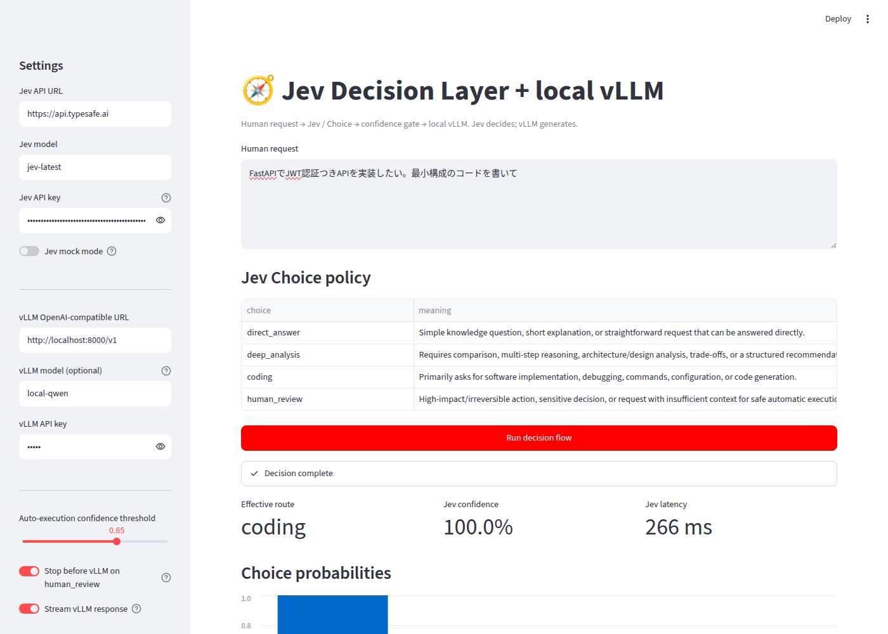

# jev-decision-router-demo

**Jev を意思決定レイヤー（System 1）、ローカル vLLM を推論・生成レイヤー（System 2）として組み合わせた Streamlit デモです。**

ユーザーの自然言語リクエストを Jev の `Choice` で分類し、Confidence Gate を通過した結果に応じて、ルートごとの System Prompt でローカル vLLM を呼び出します。
Agentic AI / Agentic Mesh における **Decision Plane（意思決定レイヤー）** の最小 PoC として利用できます。



## このデモの価値

### 1. 「判断」を生成から切り離し、ソフトウェアで扱える値にする

LLM にルーティングを任せると、判断はプロンプトと出力テキストの中に埋もれ、コードから扱いにくくなります。
このデモでは Jev が **Choice（選択肢）・各選択肢の確率・Confidence（確信度）** を型付きの値として返すので、判断を次のように通常のコードで扱えます。

- **しきい値で制御する**: 確信度が低ければ `human_review` に回す、といったルールを `if` 文 1 つで書ける（`router.py`）
- **ログに残して検証する**: なぜそのルートになったのかを、確率の分布として後から確認できる
- **テストする**: 判断の結果を入力にしたポリシーのテストを、LLM を呼ばずに書ける

### 2. 危険なリクエストを、生成が始まる前に止める

「本番 DB を削除して」のような高リスクのリクエストは、Jev が `human_review` と判断した時点で処理が止まり、vLLM は呼ばれません。
LLM に「危険なら断って」と頼むのではなく、**実行するかどうかをソフトウェアのポリシーが決める**構造なので、ガバナンスのルールをコードとして明示・監査できます。

### 3. 判断は速く、重い処理は必要なときだけ

デモ環境（RTX A1000 8GB、`Qwen/Qwen2.5-1.5B-Instruct`）での実測値です。

| 処理 | 時間 |
|---|---|
| Jev の判断 | 約 0.2〜0.27 秒 |
| vLLM の生成（ルートにより変動） | 約 1.3〜21 秒 |

判断のコストは生成に比べて小さく、ルーティングを足しても応答時間はほとんど変わりません。
また、ルートごとに System Prompt を切り替えるので、短い質問には短く、設計の相談には構造化して答えるといった使い分けを、1 つのモデルで実現できます。

### 4. 判断の精度を数値で測れる

`evals/routing_cases.jsonl` の 24 件で、実際の Jev（`jev-latest`）の選択はすべて正解でした（Gate 適用後は 23/24）。
評価コマンド（`uv run jev-router-eval`）があるので、ルート定義やしきい値を変えたときに、精度がどう変わるかをすぐに確認できます。
ただし 24 件は小さなデータセットです。実運用では、自分たちのリクエストでデータセットを作って評価してください。

### 5. 生成はローカルで、部品は差し替えられる

- 回答の生成はローカルの vLLM で行うため、プロンプトや回答の本文を外部の LLM サービスに送りません（Jev には判断のためにリクエストの本文を送ります）。
- 判断レイヤーと生成レイヤーは `DecisionClient` / `ChatClient` という小さなインターフェースで分けてあるので、Mock・別の判断モデル・別の LLM バックエンドに差し替えても、ルーターや UI のコードは変わりません。
- 8GB の GPU でも動くので、手元の環境ですぐに試せます。

### 想定する使いどころ

- 社内アシスタントやエージェントの **入口のルーター**（どの Agent・Tool・モデルに渡すか）
- 自動実行してよいか、人の確認が必要かを分ける **承認ゲート**
- 複数の LLM や System Prompt を、コストと品質で **使い分ける仕組み** の検証

---

## 目次

- [このデモの価値](#このデモの価値)
- [Concept](#concept)
- [Architecture](#architecture)
- [Decision Choices](#decision-choices)
- [Confidence Gate](#confidence-gate)
- [Jev の結果を LLM に渡す](#jev-の結果を-llm-に渡す)
- [Project Structure](#project-structure)
- [Setup](#setup)
- [Configuration](#configuration)
- [Run](#run)
- [Evaluation](#evaluation)
- [Development](#development)

---

## Concept

一般的な LLM アプリでは、意図理解・タスク分類・Agent/Tool 選択・リスク判定・推論・回答生成をすべて 1 つの LLM に任せがちです。
本プロジェクトでは「判断」と「生成」を分離し、その間に決定論的なソフトウェアポリシーを挟みます。

| レイヤー | 担当 | 役割 |
|---|---|---|
| System 1 | **Jev** | 高速な判断（どの処理を選ぶか） |
| Policy | **Python** | 決定論的な制御（Confidence Gate、ルート選択） |
| System 2 | **vLLM**（Qwen / Llama など） | 熟考・推論・文章 / コード生成 |

```text
Probabilistic AI Decision  →  Deterministic Software Policy  →  Execution
         (Jev)                        (router.py)                  (vLLM)
```

---

## Architecture

```text
              User Request
                    │
                    ▼
          ┌──────────────────┐
          │       Jev        │  Choice / Probability / Confidence
          │  Decision Layer  │
          └────────┬─────────┘
                   ▼
          ┌──────────────────┐
          │ Software Policy  │  Confidence Gate / Route Selection
          └────────┬─────────┘
          ┌────────┴─────────┐
          ▼                  ▼
     Local vLLM         Human Review
  (route別 System Prompt)   (自動生成を停止)
          │
          ▼
       Response
```

### 例

```text
FastAPIでJWT認証付きAPIを実装したい。最小構成のコードを書いてください。
```

Jev の判断結果（イメージ）：

```json
{
  "choice": "coding",
  "confidence": 0.94,
  "probabilities": {
    "direct_answer": 0.01,
    "deep_analysis": 0.04,
    "coding": 0.94,
    "human_review": 0.01
  }
}
```

→ `coding` 用 System Prompt でローカル vLLM を呼び出し、コードを生成します。

---

## Decision Choices

ルート定義は `src/jev_decision_router/routes.py` の `DEFAULT_ROUTES` にあります。

| Choice | 役割 | 入力例 |
|---|---|---|
| `direct_answer` | 単純な質問や短い説明 | 「HTTP 404 とは？」 |
| `deep_analysis` | 比較・設計・調査・複雑な分析 | 「売上悪化の原因を整理し、打ち手を比較して」 |
| `coding` | コード生成・実装・デバッグ | 「Python で CSV を読み込むコードを書いて」 |
| `human_review` | 高リスク・不可逆・情報不足で人間判断が必要 | 「顧客の本番 DB を削除して」 |

---

## Confidence Gate

Jev の判断をそのまま実行せず、Python のポリシーで検査します。

- `confidence < threshold`（デフォルト `0.65`）の場合、ルートを `human_review` に切り替える
- Jev が `DEFAULT_ROUTES` に存在しない Choice を返した場合も `human_review` に倒す
- `human_review` になった場合、サイドバーの **Stop before vLLM on human_review** が ON（デフォルト）なら vLLM を呼ばずに停止する。OFF の場合はレビュー用 System Prompt で vLLM を呼び出し、確認ポイントを整理させる

```text
choice = coding, confidence = 0.58, threshold = 0.65
  → confidence 不足 → human_review
```

---

## Jev の結果を LLM に渡す

Jev の判断は、ルートの選択（どの System Prompt を使うか）だけでなく、**確信度と他の候補ルート**としても vLLM に渡します（`prompting.py` の `DecisionContextPromptBuilder`）。
ルートの System Prompt の後ろに、次のような「Routing context」を書き添えます。

```text
## Routing context (from the decision layer)
- Selected route: deep_analysis
- Decision confidence: 0.65
- Other candidate routes: human_review (0.26)
```

確信度に応じて LLM にどう振る舞わせるかは、コード側で決めています。

| 確信度 | LLM への指示 |
|---|---|
| 0.8 以上 | 選ばれたルートのスタイルで、そのまま答える |
| 0.8 未満（またはゲートで `human_review` に回った） | 最初に解釈と前提を 1 文で述べてから、本体の回答を書く。別の解釈がありうれば、最後に一言添えるか確認の質問をする |

どちらの場合も、「ユーザーと同じ言語で答える」「Routing context や数値には触れない」と指示します。
vLLM に実際に送った System Prompt は、画面の **System prompt sent to vLLM** で確認できます。サイドバーの **Pass Jev confidence to vLLM** を OFF にすると、ルートの System Prompt だけを送ります（従来の動き）。

デモ環境（`Qwen/Qwen2.5-1.5B-Instruct`）で各条件 2 回ずつ試した結果：

- 確信度 0.65 のリクエスト（「ログ基盤を見直したい」）では、確信度を渡すと 2 回とも解釈を述べてから日本語で回答した。渡さない場合は 1 回が中国語の回答になった
- 確信度 0.90・1.00 のリクエストでは、目立った違いはなかった

試行回数が少ないため、回答の質が上がったとまでは言えません。

---

## Project Structure

```text
.
├── .env.example
├── .github/workflows/ci.yml     # GitHub Actions（ruff / mypy / pytest）
├── .pre-commit-config.yaml      # pre-commit（ruff / mypy）
├── .streamlit/config.toml       # Streamlit 設定
├── CLAUDE.md                    # 開発ルール（SOLID / テスト / lint）
├── pyproject.toml               # uv / pytest / ruff / mypy / coverage の設定
├── uv.lock
├── docs/                        # TODO・スクリーンショット
├── evals/routing_cases.jsonl    # ルーティング精度の評価データセット
├── src/jev_decision_router/
│   ├── app.py                   # Streamlit UI（表示と入力のみ）
│   ├── interfaces.py            # DecisionClient / ChatClient などの抽象インターフェース
│   ├── routes.py                # Route 定義（Choice・選択基準・System Prompt）
│   ├── router.py                # DecisionRouter（Confidence Gate）
│   ├── flow.py                  # DecisionFlow（判断 → 停止判定 → 生成）
│   ├── prompting.py             # Jev の結果（確信度など）を System Prompt に書き添える
│   ├── jev_client.py            # Jev API クライアント（POST /v1/systemone）
│   ├── mock_jev_client.py       # UI 確認用の Mock クライアント
│   ├── vllm_client.py           # vLLM OpenAI 互換 API クライアント
│   ├── retry.py                 # リトライポリシー（指数バックオフ）
│   ├── evaluation.py            # ルーティング精度の評価（jev-router-eval）
│   ├── config.py                # 環境変数 → Settings
│   └── factory.py               # Settings から各クライアントを生成
└── tests/                       # pytest
```

### vLLM とのインターフェース

生成レイヤーとのやり取りは、`interfaces.py` の 2 つの Protocol だけを通して行います。

```python
class ChatClient(Protocol):  # 必須
    def chat(self, request: ChatRequest) -> ChatResponse: ...


class StreamingChatClient(Protocol):  # 任意（ストリーミング対応）
    def stream(self, request: ChatRequest) -> ChatStream: ...
```

| 型 | フィールド |
|---|---|
| `ChatRequest` | `system_prompt`, `user_prompt`, `temperature=0.2`, `max_tokens=1200` |
| `ChatResponse` | `content`, `model` |
| `ChatStream` | `model`, `chunks`（テキスト断片のイテレータ） |

`StreamingChatClient` を実装していないバックエンドでは、`DecisionFlow.stream` が通常の応答を 1 つの断片として返すので、UI はそのまま動きます。

`VLLMClient` はこれを vLLM の OpenAI 互換 API に変換します。

| メソッド | パス | 用途 |
|---|---|---|
| `GET` | `{VLLM_BASE_URL}/models` | `VLLM_MODEL` が空のとき、先頭のモデルを自動選択する |
| `POST` | `{VLLM_BASE_URL}/chat/completions` | `messages=[system, user]` を送り、`choices[0].message.content` を返す |
| `POST` | `{VLLM_BASE_URL}/chat/completions`（`stream: true`） | SSE の `choices[0].delta.content` を順に返す（`data: [DONE]` で終了） |

408・429・5xx と接続エラーは `retry.RetryPolicy` に従ってリトライします。最終的に失敗した場合は `ChatError` を送出します。別の LLM バックエンドを使う場合は、`ChatClient` を満たすクラスを追加し、`factory.build_chat_client` で切り替えます。

---

## Setup

### 1. 依存関係のインストール

```bash
git clone <repository-url>
cd jev-decision-router-demo

uv sync
```

[uv](https://docs.astral.sh/uv/) が必要です。`uv sync` を実行すると `.venv` が作成され、開発用の依存（pytest / ruff / mypy / pre-commit）も含めてインストールされます。

### 2. ローカル vLLM の起動

vLLM の OpenAI 互換サーバを起動します（例：Qwen）。

```bash
vllm serve Qwen/Qwen2.5-7B-Instruct \
  --host 0.0.0.0 \
  --port 8000 \
  --served-model-name local-qwen
```

API は `http://localhost:8000/v1` で提供されます。Llama / Mistral / DeepSeek など vLLM 対応モデルであれば利用できます。

vLLM はアプリの依存には含めていません。別の環境に入れてください（例：`uv tool install vllm`）。

#### 8GB 程度の GPU で動かす場合

7B モデルは 8GB の GPU（例：RTX A1000）には載らないため、小さいモデルを使い、コンテキスト長とメモリ使用率を抑えます。

```bash
VLLM_USE_FLASHINFER_SAMPLER=0 vllm serve Qwen/Qwen2.5-1.5B-Instruct \
  --host 0.0.0.0 \
  --port 8000 \
  --served-model-name local-qwen \
  --max-model-len 4096 \
  --gpu-memory-utilization 0.85
```

- `VLLM_USE_FLASHINFER_SAMPLER=0`：CUDA Toolkit（`nvcc`）が入っていない環境では、FlashInfer のサンプラーがカーネルをコンパイルできず、`Could not find nvcc` で起動に失敗します。この環境変数で FlashInfer のサンプラーを使わないようにします。
- `--max-model-len 4096`：KV キャッシュに必要な GPU メモリを減らします。
- `--gpu-memory-utilization 0.85`：GPU メモリの 85% までを vLLM に割り当てます。

---

## Configuration

`.env.example` をコピーして `.env` を作成し、`TYPESAFE_API_KEY` などを編集します。設定値はアプリのサイドバーからも変更できます。

```bash
cp .env.example .env
```

| 変数 | デフォルト | 説明 |
|---|---|---|
| `TYPESAFE_API_KEY` | （なし） | Jev の API キー。Mock Mode OFF 時は必須 |
| `JEV_BASE_URL` | `https://api.typesafe.ai` | Jev API の URL |
| `JEV_MODEL` | `jev-latest` | Jev モデル名 |
| `JEV_MOCK_MODE` | `false` | `true` でキーワードベースの Mock 判定を使用 |
| `JEV_CONFIDENCE_THRESHOLD` | `0.65` | Confidence Gate のしきい値 |
| `JEV_TIMEOUT` | `30` | Jev API のタイムアウト（秒） |
| `JEV_MAX_RETRIES` | `2` | Jev API のリトライ回数（429・529 などのとき。`0` でリトライしない） |
| `VLLM_BASE_URL` | `http://localhost:8000/v1` | vLLM の OpenAI 互換 API の URL |
| `VLLM_MODEL` | （空） | 空の場合は `/v1/models` の先頭モデルを自動選択 |
| `VLLM_API_KEY` | `EMPTY` | vLLM の API キー |
| `VLLM_TIMEOUT` | `180` | vLLM のタイムアウト（秒） |
| `VLLM_MAX_RETRIES` | `2` | vLLM のリトライ回数（5xx・接続エラーなどのとき） |

リトライは指数バックオフ（0.5 秒 → 1 秒 → …、上限 5 秒）で行い、`Retry-After` ヘッダーがあればそれに従います。TypeSafe 公式 SDK のデフォルトに合わせています。

### Mock Mode

Jev の API キーがなくても UI やルーティングの動作を確認できます。
`JEV_MOCK_MODE=true` にすると、キーワードマッチによる決定論的な判定を返します。**UI 確認用であり、Jev の代替ではありません。**

---

## Run

vLLM を起動した状態で、Streamlit を起動します。

```bash
uv run streamlit run src/jev_decision_router/app.py
```

ブラウザで <http://localhost:8501> にアクセスします。

### 処理フロー

1. **User Request** — テキストを入力し「Run decision flow」を押す
2. **Jev Decision** — Choice / Probability / Confidence を取得
3. **Policy Evaluation** — Confidence Gate でルートを確定（不足時は `human_review`）
4. **Execution** — ルート別 System Prompt に確信度などを書き添えて、ローカル vLLM を呼び出す（`human_review` は停止）
5. **Response** — 回答をストリーミング表示し、Jev のレイテンシ・最初のトークンまでの時間・vLLM 全体のレイテンシを表示

サイドバーの **Stream vLLM response** を OFF にすると、回答がそろってから一度に表示します。

### 画面例

| ルート | 画面 |
|---|---|
| `direct_answer` | [docs/images/route-direct_answer.png](docs/images/route-direct_answer.png) |
| `deep_analysis` | [docs/images/route-deep_analysis.png](docs/images/route-deep_analysis.png) |
| `coding` | [docs/images/route-coding.png](docs/images/route-coding.png) |
| `human_review` | [docs/images/route-human_review.png](docs/images/route-human_review.png) |

---

## Evaluation

`evals/routing_cases.jsonl` に、入力と期待するルートの組（4 ルート × 6 件）を用意しています。

```bash
uv run jev-router-eval                  # .env の設定（実際の Jev）で評価
uv run jev-router-eval --mock           # Mock で評価
uv run jev-router-eval --threshold 0.8  # しきい値を変えて評価
```

Confidence Gate を適用する前の Jev の選択（Raw accuracy）と、適用後のルート（Route accuracy）の正解率を、ルートごとの正解率・失敗したケースとあわせて表示します。

実際の Jev（`jev-latest`）での結果（しきい値 0.65）：

| 指標 | 値 |
|---|---|
| Raw accuracy | 100.0%（24/24） |
| Route accuracy | 95.8%（23/24） |
| Gate で `human_review` に回った件数 | 1 |

Gate に回った 1 件（SQL のインデックス相談）は、Jev の選択自体は `coding` で正しかったものの、確信度が 0.33 と低かったため `human_review` になりました。しきい値はデータと誤判定のコストを見て調整してください。

---

## Development

開発ルールの詳細は [CLAUDE.md](CLAUDE.md) を参照してください。

```bash
uv run pytest                                          # テスト（カバレッジ 90% 未満で失敗）
uv run ruff check . && uv run ruff format --check .    # lint / フォーマット確認
uv run ruff check --fix . && uv run ruff format .      # 自動修正
uv run mypy                                            # 型チェック（strict）
uv run pre-commit install                              # コミット時に ruff / mypy を自動実行
```

GitHub Actions（`.github/workflows/ci.yml`）で、push と pull request のたびに ruff・mypy・pytest を実行します。
